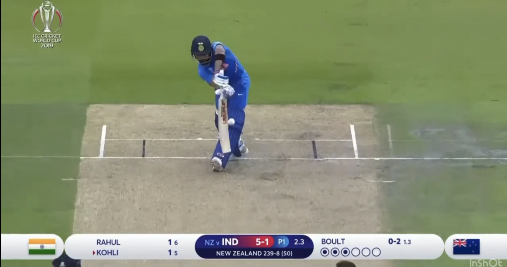
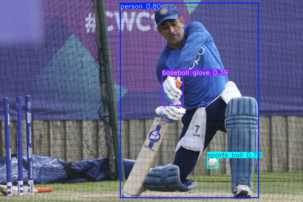
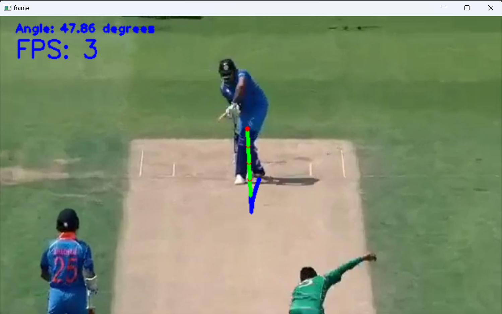
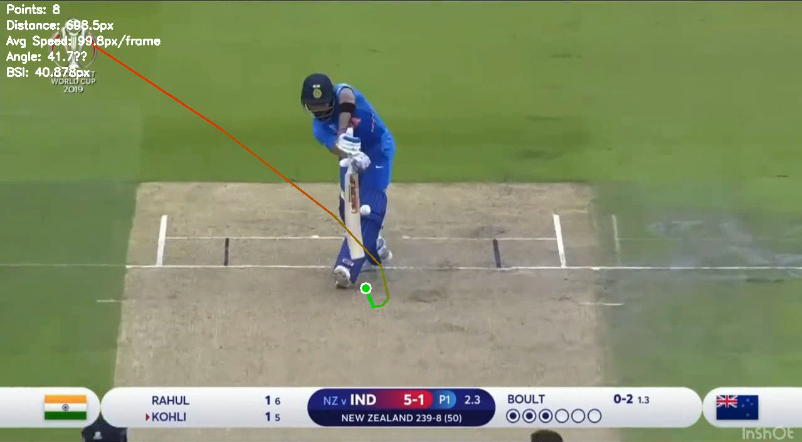
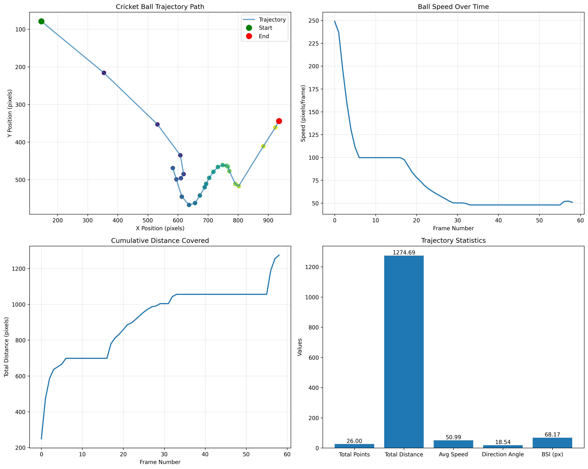
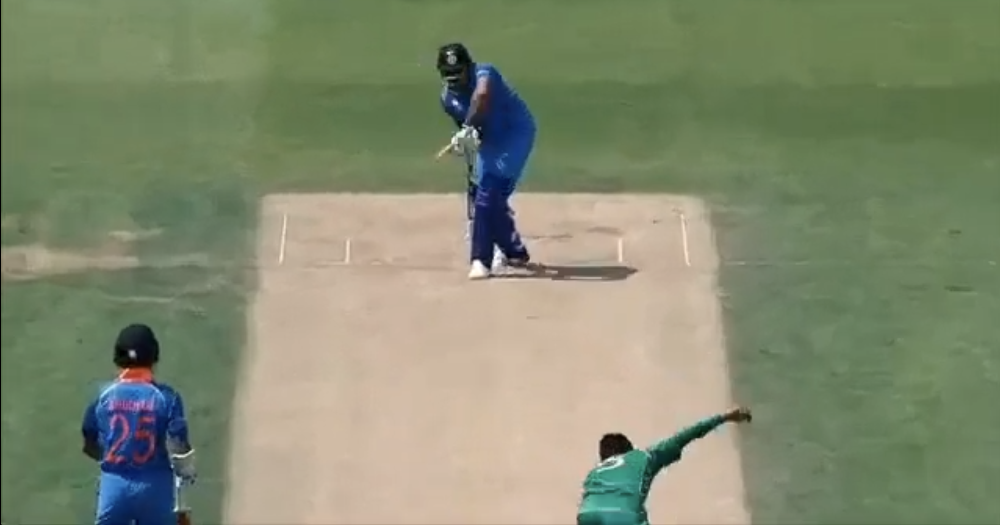

# 🏏 Cricket Ball Analyzer

<p align="center">


</p>

<p align="center">
An AI-powered Computer Vision project for detecting, tracking, and analyzing cricket ball trajectories using YOLOv8, OpenCV, and Python.
</p>

---

# 📖 Overview

Cricket Ball Analyzer is a Computer Vision and Deep Learning project that automatically detects, tracks, and analyzes the trajectory of a cricket ball from video footage.

The system utilizes a **custom-trained YOLOv8 model** to identify the cricket ball frame-by-frame and applies tracking techniques to visualize the complete trajectory. It also computes several performance metrics, including ball speed, travel distance, trajectory angle, and Ball Swing Intensity (BSI), providing valuable insights for sports analytics and coaching.

---

# ✨ Features

- 🎯 Cricket Ball Detection using a custom-trained YOLOv8 model
- 🎥 Frame-by-frame video processing
- 📍 Ball Tracking across consecutive frames
- 📈 Ball Trajectory Prediction and Visualization
- ⚡ Average Ball Speed Estimation
- 📏 Total Distance Calculation
- 📐 Trajectory Angle Estimation
- 🏏 Ball Swing Intensity (BSI) Analysis
- 📊 Statistical Performance Analysis
- 🖥️ Graphical Visualization using Matplotlib

---

# 🛠️ Tech Stack

| Technology | Purpose |
|------------|----------|
| Python | Core Programming Language |
| OpenCV | Image & Video Processing |
| YOLOv8 | Cricket Ball Detection |
| Ultralytics | Model Training & Inference |
| Roboflow | Dataset Annotation |
| NumPy | Numerical Computation |
| Matplotlib | Performance Visualization |
| Git LFS | Large File Storage |

---

# 📂 Project Structure

```text
Cricket-Ball-Analyzer/
│
├── assets/
│   ├── input_frame.png
│   ├── dataset_sample.jpg
│   ├── yolo_detection.png
│   ├── realtime_tracking.png
│   ├── trajectory_prediction.png
│   ├── trajectory_analysis.png
│   └── actual_ball_path.png
│
├── Cricket_Ball_detection-1/
├── images/
├── output/
├── videos/
│
├── predict.py
├── trajectory.py
├── TESTING.py
├── data.yaml
├── requirements.txt
└── README.md
```

---

# 🔄 Project Workflow

```text
Input Cricket Video
        │
        ▼
Frame Extraction
        │
        ▼
YOLOv8 Ball Detection
        │
        ▼
Ball Tracking
        │
        ▼
Trajectory Prediction
        │
        ▼
Performance Metrics
        │
        ▼
Visualization & Output
```

---

# 📸 Project Results

## 1️⃣ Input Video Frame

Original frame extracted from the cricket video before processing.

<p align="center">

</p>

---

## 2️⃣ Dataset Sample

Sample image used for training the custom YOLOv8 model.

<p align="center">

</p>

---

## 3️⃣ YOLOv8 Object Detection

Detection of the cricket ball using the trained YOLOv8 model.

<p align="center">

</p>

---

## 4️⃣ Real-Time Ball Tracking

Live tracking with trajectory updates, FPS display, and trajectory angle estimation.

<p align="center">

</p>

---

## 5️⃣ Predicted Ball Trajectory

Visualization of the predicted trajectory generated after tracking multiple frames.

<p align="center">

</p>

---

## 6️⃣ Trajectory Analysis

Statistical analysis including trajectory path, speed variation, cumulative distance, trajectory angle, and Ball Swing Intensity Index (BSI).

<p align="center">

</p>

---

## 7️⃣ Actual Ball Path

Final tracked ball trajectory generated from processed video frames.

<p align="center">

</p>

---

# 📊 Performance Metrics

The system computes the following metrics:

| Metric | Description |
|---------|-------------|
| Ball Detection | Cricket ball localization using YOLOv8 |
| Total Distance | Total path traveled by the ball |
| Average Speed | Estimated average ball speed |
| Direction Angle | Direction of ball movement |
| Ball Swing Intensity (BSI) | Swing deviation indicator |
| Trajectory Path | Visual representation of ball movement |

---

# ⚙️ Installation

Clone the repository:

```bash
git clone https://github.com/vivek08248/Cricket-Ball-Analyzer.git
```

Navigate to the project directory:

```bash
cd Cricket-Ball-Analyzer/Cricket-Ball-Trajectory-Prediction
```

Install the required dependencies:

```bash
pip install -r requirements.txt
```

---

# ▶️ Usage

Run the detection pipeline:

```bash
python predict.py
```

or execute the trajectory analysis:

```bash
python trajectory.py
```

---

# 🚀 Future Enhancements

- Real-time webcam support
- 3D trajectory reconstruction
- Ball bounce prediction
- Swing and spin classification
- Multi-camera tracking
- Player performance analytics
- Edge AI deployment
- Mobile application integration

---

# 👨‍💻 Authors

This project was developed by:

- **C. Vivek**
- **B. Praneeth Reddy**
- **G. Rohit Reddy**

**Department of Electronics and Communication Engineering**  
**Vasavi College of Engineering (Autonomous), Hyderabad**

---

# 🙏 Acknowledgements

We also acknowledge the following open-source technologies and communities:

- Ultralytics YOLOv8
- Roboflow
- OpenCV
- Python Community
- NumPy
- Matplotlib

---

# 📜 License

This project is intended for academic and educational purposes.

---

# ⭐ Support

If you found this project useful, please consider giving it a ⭐ on GitHub.
